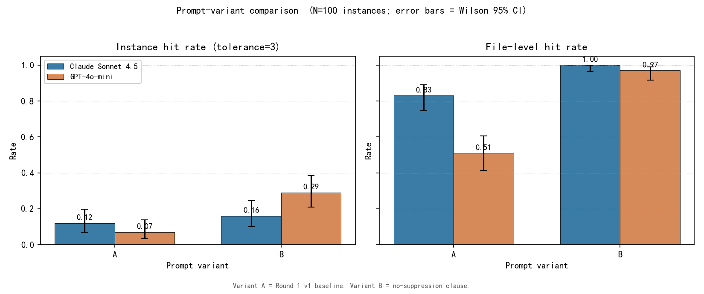

# SWE-Review-Bench

A benchmark for **cold code-review bug finding** on SWE-bench Lite.
Current state: an evaluation pipeline and an n=100 preliminary study.

## Motivation

SWE-bench measures whether a system can resolve a known issue when
given the issue text, the failing tests, and the surrounding repo.
That is a *fix-given-issue* task: the system already knows where to
look. A different and arguably harder question is whether a system
can **locate** a defect from the source alone, without an issue
report or failing tests to anchor on. The skill exercised in a real
pre-commit code review, "is something wrong with this file?", is not
what SWE-bench fix-resolved rate measures.

SWE-Review-Bench evaluates LLM-based and static reviewers under the
cold-review setup: the reviewer is shown only the buggy file at its
pre-fix commit and asked to flag concrete correctness, reliability,
or maintainability issues in a structured JSON format. The oracle
(the fix patch's line ranges) is read **only** by the scorer, after
the reviewer has emitted its output.

## Key findings (n=100 preliminary study)

The 100 instances are a strict superset of the original 20-instance
pilot (the pilot ids are a deterministic subset under `seed=42`), so
the pilot's cached reviewer outputs are reused rather than re-billed.
All numbers below are at the default line tolerance `N=3` and carry
Wilson 95% intervals where a rate is reported.

**1. Prompt sensitivity is model-specific.** Removing one clause from
the prompt body, the no-speculation instruction `"Do not invent
issues. If the code looks correct to you, return an empty list."`,
moves GPT-4o-mini's instance hit rate from 0.07 to 0.29 (22 instances
flip to a hit, 0 flip away, McNemar exact p < 0.0001) but does not
significantly move Claude Sonnet 4.5 (0.12 to 0.16, p = 0.34). The
prompt sensitivity is a property of the model, not a shared effect.
A consequence is that a single-prompt benchmark would report
prompt-dependent, possibly inverted, reviewer rankings.

**2. Precision, not hit rate, separates LLM reviewers from static
analysis.** The static union of filtered Ruff and Pylint reaches a
0.27 instance hit rate, comparable to the LLM reviewers, but only by
emitting 12.41 false positives per instance. Claude under the
baseline prompt emits 1.60. Even GPT-4o-mini's higher hit rate under
the no-speculation-removed variant (0.29 vs Claude's 0.16) is
volume-driven: it emits 565 comments against Claude's 237 over the
100 instances.

**3. The oracle has a measurable construct-validity ceiling.** A
30-instance hand audit found that only 24 of 48 oracle sites (0.50,
Wilson 95% [0.36, 0.64]) mark an actual defect a reviewer should
flag, and 10 of 30 instances (0.33, [0.19, 0.51]) carry no
cold-reviewable bug at all. Six of those ten are feature or
enhancement requests where the pre-fix code has no defect and the
oracle marks a feature insertion point. Headline rates should be read
with this oracle noise in mind.

Under the baseline prompt (Variant A) the two LLM reviewers are
statistically indistinguishable on instance hit rate (Claude 0.12,
GPT 0.07, McNemar p = 0.33). The benchmark does not claim a
model-capability ranking on bug finding and is not designed to
produce one.



*n=100; error bars are Wilson 95% CIs. Variant A is the baseline
prompt; Variant B removes the no-speculation clause.*

## Task definition

For each instance in the dataset, the reviewer's input is exactly:

- `file_path`: relative path of one file touched by the fix patch.
- `file_content`: full pre-fix source content of that file, at the
  instance's `base_commit`.
- A generic review instruction (the prompt template body).
- The output JSON schema.

The reviewer's output is a JSON array of comments matching:

```json
{
  "file": "django/http/response.py",
  "line_start": 173,
  "line_end": 173,
  "severity": "low | medium | high",
  "message": "one short sentence"
}
```

The scorer then matches each comment's `(file, line_start, line_end)`
against oracle hunks recovered from the fix patch, under a line
tolerance `N` (default `N = 3`). An instance counts as a **hit** if
at least one comment matched any oracle hunk on that instance.

The cold-review input policy and the corresponding pytest assertions
are documented in `docs/leakage_statement.md` and
`tests/test_no_leakage.py`. The reviewer's input never contains
`problem_statement`, `hints_text`, `patch`, `test_patch`, test names
extracted from `test_patch`, or oracle line numbers.

## Dataset

- Source: [`princeton-nlp/SWE-bench_Lite`](https://huggingface.co/datasets/princeton-nlp/SWE-bench_Lite), `split=test`.
- Sampling: `random.Random(42).sample(range(len(ds)), 100)`, a
  deterministic 100-instance sample of the 300-instance test split.
  Under the pinned environment the 20-instance pilot ids are an exact
  subset of these 100, so pilot reviewer outputs are reused as cache
  hits.
- Single file per instance: SWE-bench Lite is a single-file-fix
  subset, and all 100 sampled instances touch exactly one non-test
  file. This study therefore has no multi-file breakdown; that would
  require full SWE-bench or the Verified split.
- Dataset revision: a post-hoc snapshot of the HuggingFace dataset
  state is recorded at `outputs/round2/h_lite/dataset_revision.json`
  (`hf_commit_sha`: `6ec7bb89b9342f664a54a6e0a6ea6501d3437cc2`). The
  load timestamp and the `litellm` and `datasets` library versions
  are in the run metadata.

## Reviewers

| reviewer       | id (resolved) | source                                  |
|---|---|---|
| Claude Sonnet  | `claude-sonnet-4-5`  | Anthropic API via `litellm` 1.83.9 |
| GPT-4o-mini    | `gpt-4o-mini`        | OpenAI API via `litellm` 1.83.9    |
| Static union   | `static`             | Ruff (`F,E9,B,A`) ∪ Pylint (default minus `C,R,I,import-error,no-name-in-module`) |

The static reviewer is intentionally Python-only and runs locally;
both LLM reviewers are accessed through `litellm` so the same client
code handles both providers. Static comments are capped at
`--max-comments-per-file 20` to keep the false-positive count
bounded. The static reviewer is prompt-agnostic, so prompt-variant
experiments evaluate only the two LLM reviewers.

## Metrics

Reviewer outputs are scored under `--tolerance N` (default 3) against
oracle hunks built with `swe_review_bench.data.oracle.build_oracle_sites`
in `strict_mode=False` (one site per hunk, line range covering the
full hunk source range).

| metric                  | definition                                                                                          |
|---|---|
| `instance_hit_rate`     | instances where the reviewer hit at least one oracle hunk under tolerance N, over the 100 instances scored. |
| `site_recall`           | oracle sites hit, over total oracle sites across scored instances.                                  |
| `file_level_hit_rate`   | instances where the reviewer emitted at least one valid comment on any oracle file, ignoring line numbers. |
| `false_positives_per_instance_mean` | mean of `n_comments - n_hits` across instances.                                            |

## Results (n=100, tolerance N=3)

Two prompt variants are scaled to n=100: Variant A (`v1`, the
baseline, which keeps the no-speculation clause) and Variant B
(`v1b`, identical except that clause is removed). The static reviewer
is variant-agnostic.

| reviewer / variant   | instance hit rate            | file-level hit rate | site recall | FP / instance |
|---|---|---|---|---:|
| `claude-sonnet-4-5` A | 12/100 = 0.12 [0.070, 0.198] | 0.83 | 0.081 | 1.60 |
| `gpt-4o-mini` A       | 7/100 = 0.07 [0.034, 0.137]  | 0.51 | 0.047 | 1.99 |
| `claude-sonnet-4-5` B | 16/100 = 0.16 [0.101, 0.244] | 1.00 | 0.114 | 2.20 |
| `gpt-4o-mini` B       | 29/100 = 0.29 [0.210, 0.385] | 0.97 | 0.201 | 5.15 |
| `static`              | 27/100 = 0.27 [0.193, 0.364] | n/a  | 0.208 | 12.41 |

Machine-readable cells are in `outputs/n100/variant_summary.csv`. The
static reviewer's file-level rate was not computed in this pass.

What n=100 changes versus the pilot: the pilot's most eye-catching
number, Claude scoring 0/20 at the line level under Variant A, was a
small-sample artefact. At n=100 Claude-A scores 0.12. The Variant B
point estimates are stable from pilot to n=100 (Claude 0.15 to 0.16,
GPT 0.30 to 0.29).

## Prompt sensitivity (paired McNemar, A vs B)

| reviewer | A | B | discordant (B-only / A-only) | McNemar exact p |
|---|---:|---:|---|---|
| `claude-sonnet-4-5` | 0.12 | 0.16 | 7 / 3  | 0.34     |
| `gpt-4o-mini`       | 0.07 | 0.29 | 22 / 0 | < 0.0001 |

Removing the no-speculation clause moves GPT-4o-mini decisively (22
instances flip to a hit, none flip away) but does not significantly
move Claude. The prompt-sensitivity effect is specific to
GPT-4o-mini, not a shared property of both reviewers.

## Model comparison (paired McNemar, Claude vs GPT)

| variant | Claude | GPT  | discordant (Claude-only / GPT-only) | McNemar exact p |
|---|---:|---:|---|---|
| A | 0.12 | 0.07 | 11 / 6 | 0.33  |
| B | 0.16 | 0.29 | 6 / 19 | 0.015 |

Under the baseline prompt the two reviewers are statistically
indistinguishable. Under Variant B, GPT-4o-mini's instance hit rate
is significantly higher, but the advantage is volume-driven: 565
comments (5.15 FP/instance) against Claude's 237 (2.20 FP/instance).

## Tolerance sensitivity (zero additional API cost)

Re-scoring the stored comments at three tolerances, with the oracle
and matcher held fixed (`outputs/n100/tolerance_sweep.csv`):

| N | claude A | gpt A | claude B | gpt B |
|---:|---:|---:|---:|---:|
| 0  | 0.10 | 0.06 | 0.14 | 0.20 |
| 3  | 0.12 | 0.07 | 0.16 | 0.29 |
| 10 | 0.18 | 0.12 | 0.24 | 0.40 |

Hit rates rise monotonically with tolerance, as expected. The GPT-B
over Claude-B ordering holds across all three.

## Oracle construct validity (30-instance audit)

The benchmark assumes a fix patch's hunk source ranges mark the buggy
code a reviewer should flag. To test that assumption a stratified
30-instance sample (all 10 repos) from the n=100 study was audited by
hand: each reconstructed oracle site was labelled `bug`, `related`,
or `unrelated`. Labels were drafted with LLM assistance and
human-confirmed; the method and per-site verdicts are in
`outputs/n100/oracle_validity_report.md` and
`outputs/n100/oracle_validity_cards.md`.

- Site-level bug-site fraction: 24/48 = 0.50, Wilson 95% [0.36, 0.64].
- Instances with at least one bug site: 20/30 = 0.67.
- Instances with no bug site: 10/30 = 0.33, Wilson 95% [0.19, 0.51].
  Six are explicit feature or enhancement requests where the pre-fix
  code has no defect.

This is construct-validity evidence on a 30-instance sample, not a
proportion estimate over full SWE-bench Lite, and the interval is
wide. It licenses the claim that oracle noise is real and is
dominated by feature/enhancement and insertion-point oracles.

## Cost

| stage | spend |
|---|---:|
| Round 1 pilot (frozen) | $0.91 |
| Round 2 variant probe (frozen) | $1.92 |
| n=100 extension, GPT (variants A+B) | $0.27 |
| n=100 extension, Claude (variants A+B) | $6.43 |
| total | $9.53 |

The n=100 extension reused the 20 pilot instances as cache hits and
billed only the 80 new instances per variant. The Claude run carried
a $10 hard cap with an automatic abort at $9; actual spend was $6.43.

## Reproducibility

Cache-safe default (issues no paid API calls):

```bash
bash repro/run.sh
```

This runs the leakage test suite and prints the headline tables and
Wilson intervals from the frozen artefacts. The current orchestrator
does not expose a fail-on-cache-miss flag, so the script reads the
frozen CSVs directly rather than re-invoking the paid pipeline.

The full gated execution sequence for the n=100 study, including the
dry-run cost projection, the spend gates, and the per-step commands,
is in `docs/execution_plan_n100.md`. Frozen configuration:

| field                | value                                       |
|---|---|
| dataset              | `princeton-nlp/SWE-bench_Lite`, split `test` |
| sampling seed        | `42`                                        |
| `n`                  | 100                                         |
| `tolerance` (headline) | 3                                         |
| `max_comments_per_file` | 20                                       |
| variants scaled to n=100 | `v1` (A) and `v1b` (B); `v1c` (C) stays a pilot-only diagnostic |
| `strict_oracle_mode` | `false`                                     |
| `litellm` version    | `1.83.9`                                    |
| Python               | `3.9.12`                                    |

Cache behaviour: Round 1 LLM responses live under `.cache/llm/` and
are read-only. The n=100 cache accumulates under `.cache/round2/llm/`,
append-only. The cache key is
`sha256(resolved_model, template_id, file_path, file_content)` and
omits the instance id, so a reused instance hits as long as its file
content is byte-identical. The run metadata records the resolved
model ids, wall time, and run timestamp.

## Leakage prevention

The cold-review input policy is documented in
`docs/leakage_statement.md`. The corresponding pytest assertions are
in `tests/test_no_leakage.py`: every (instance, prompt variant, file)
cell is checked for verbatim leakage of the problem statement, hints
text, patch markers, test patch, test names, and oracle line numbers.
No Claude call is issued on a new instance until its prompt has
passed these assertions.

```bash
pytest -v tests/test_no_leakage.py
```

## Limitations

- **Preliminary sample.** `n = 100` is a third of SWE-bench Lite.
  Wilson 95% intervals are roughly half the pilot's width but still
  non-trivial; full Lite (n=300) is the next scale step.
- **Single-file review only.** Each reviewer is shown one file per
  instance. Cross-file reasoning, retrieval, and multi-file context
  are out of scope, and SWE-bench Lite is single-file by
  construction.
- **Oracle construct validity.** As the audit above shows, about a
  third of audited instances carry no cold-reviewable bug, so
  headline rates understate per-bug detection by an unknown amount; a
  bug-only headline would require auditing all 100 instances.
- **Two models, two prompt variants.** No top-tier model upper bound
  (such as Claude Opus or GPT-4o), no multi-seed robustness check,
  and no prompt variants beyond A/B/C at this scale. These are
  deferred to the credit-funded plan in `docs/budget_request.md`.
- **No formal model ranking.** This benchmark does not claim "model X
  is better than model Y at code review". The comparisons surface
  prompt-sensitivity, precision, and recall trade-offs only.

## License

MIT, see [`LICENSE`](LICENSE).

## About

SWE-Review-Bench is built and maintained by an independent CS
master's student. The current contribution is an evaluation
pipeline, an n=100 preliminary study with frozen artefacts and
paired-comparison statistics, a 30-instance oracle-validity audit,
and a pytest leakage suite.

- Contact: lmnstzz@gmail.com
- GitHub: github.com/lmnst
- Repository: github.com/lmnst/SWE-Review-Bench

Reference this work by citing the repository.
