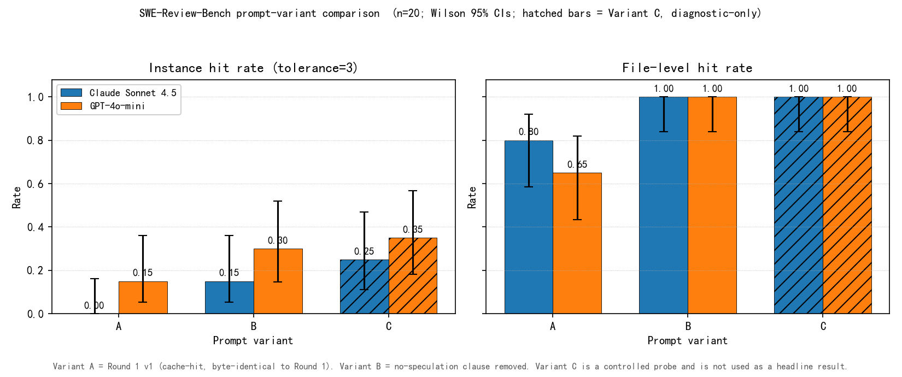

# Preliminary results (SWE-Review-Bench, 20-instance pilot)

Headline numbers from the SWE-Review-Bench pilot. The 20-instance pilot uses `princeton-nlp/SWE-bench_Lite`, `split=test`, `seed=42`, oracle `strict_mode=False`, default tolerance N=3. Wilson 95% intervals are given in brackets for every rate cell; the methodology and formula are recorded in `outputs/round2/h_lite/ci_methodology.md`.

## Round 1 baseline (prompt `v1`)

| reviewer | instance hit rate | file-level hit rate | site recall | FP / instance |
|---|---|---|---|---:|
| `claude-sonnet-4-5` | 0/20 = 0% [0.000, 0.161] | 16/20 = 80% [0.584, 0.919] | 0/32 = 0% [0.000, 0.107] | 1.50 |
| `gpt-4o-mini` | 3/20 = 15% [0.052, 0.360] | 13/20 = 65% [0.433, 0.819] | 3/32 = 9% [0.032, 0.242] | 2.20 |
| `static` | 3/20 = 15% [0.052, 0.360] | 15/20 = 75% [0.531, 0.888] | 4/32 = 12% [0.050, 0.281] | 11.75 |

## Round 2 prompt-variant experiment (Claude + GPT-4o-mini only)

| variant | reviewer | instance hit rate | note |
|---|---|---|---|
| A | `claude-sonnet-4-5` | 0/20 = 0% [0.000, 0.161] | Round 1 baseline (`v1`) |
| A | `gpt-4o-mini` | 3/20 = 15% [0.052, 0.360] | Round 1 baseline (`v1`) |
| B | `claude-sonnet-4-5` | 3/20 = 15% [0.052, 0.360] | no-speculation clause removed (`v1b`) |
| B | `gpt-4o-mini` | 6/20 = 30% [0.145, 0.519] | no-speculation clause removed (`v1b`) |
| C | `claude-sonnet-4-5` | 5/20 = 25% [0.112, 0.469] | diagnostic-only probe; forces ≥1 comment per file |
| C | `gpt-4o-mini` | 7/20 = 35% [0.181, 0.567] | diagnostic-only probe; forces ≥1 comment per file |

## Cost summary

- Round 1 baseline: total **$0.9098** across 60 reviewer/instance cells (LLM-only spend; `claude-sonnet-4-5` $0.8738, `gpt-4o-mini` $0.0359, static $0).
- Round 2 diagnostic: **$1.92, 120 calls** (Variant A all cache hits at $0; Variants B and C cache-missed and cost about $0.95 each on Claude plus a few cents on GPT-4o-mini).
- Hard cap for Round 2 was $5; actual spend was 38% of the cap.

## Figure

*n=20 per instance-level cell; error bars are Wilson 95% CIs; Variant C is a controlled probe and is not used as a headline result.*

## Framing

n=20 is a pilot; CIs are wide; prompt sensitivity appears material; full Lite is needed before final claims.
